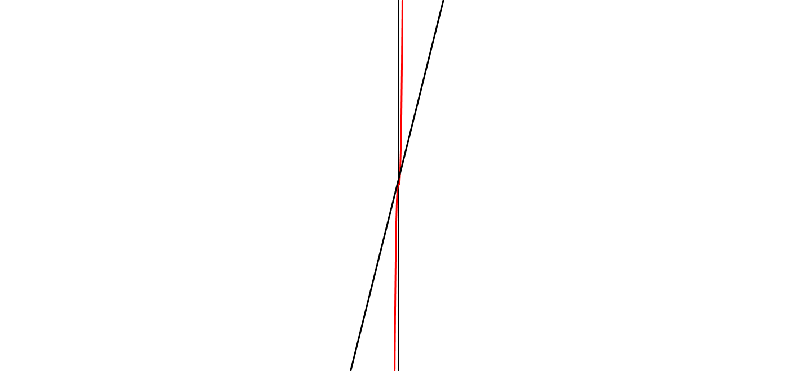
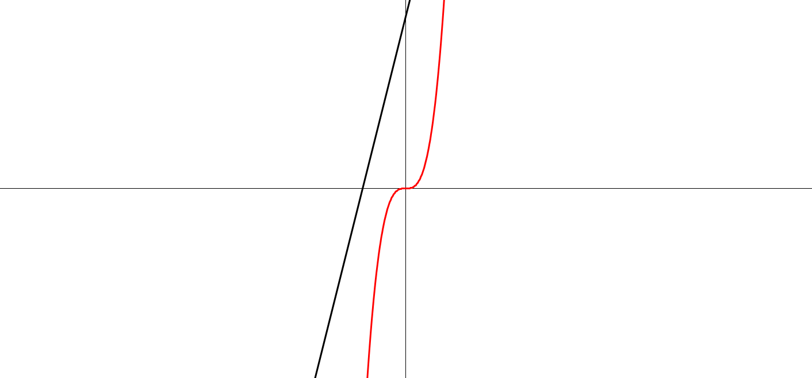

# - 평면 좌표 개인프로젝트

- ~ 2019 . 07 . 05

- **제작 동기**

1학기 동안 제대로 된 개인프로젝트가 없어 방학 안엔 멋진 아웃풋이 하나 필요할 것 같아서 진행하게 됨. 

- **프로젝트 목표**
1. C++ MFC 기반, GDI+ 라이브러리를 사용한다.
2. 최대한 모든 함수를 그릴 수 있다.
3. 좌표계가 이동 해야 한다.
4. 확대가 가능해야 한다.
5. 사용자가 함수를 추가 할 수 있어야 한다.
6. 사용자가 함수를 선택하여 삭제 할 수 있어야 한다.
7. 좌표계에 눈금과 숫자가 있어야 한다. 
8. 버그가 없어야 한다.
9. 모든 도형들은 안티 에일리어싱 처리를 한다.

- **To do list**
- [x]  좌표 축 그리기
- [x]  슈퍼 클래스 그래프 구현
- [x]  1차 함수 구현
- [x]  N차 함수 구현
- [x]  확대/축소 구현

### 업데이트 내역

- **모든 도형의 기본이 되는 부모 클래스 CGraph**

    ```c++
    #include <vector>
    #include "Fract.h"
    using namespace std;
    class CGraph
    {
    protected:
    	using Terms = vector<CFract>;
    
    public:
    	CGraph();
    	~CGraph();
    	virtual void Draw(Graphics& G, CRect& rect) = 0;
    	virtual void SetFunction(Terms args);
    	virtual bool IsSelected(CPoint& pt, CPoint& center);
    
    
    	void Initialize(Color color, int thick);
    	static int m_nRatio;
    	static int m_nDx, m_nDy;
    
    
    protected:
    	int f(int x);
    	int m_nThick;
    	Color m_Color;
    	Terms m_Coeff;
    };
    ```

멤버 변수로는 색, 두께, 식의 항 (Term) 을 가지는 클래스. 각 도형마다 자신을 그리는 방법은 모두 다르기에 Draw() 함수를 순수 가상 함수로 만들어 자식 클래스들이 반드시 재정의 하게 하고 동시에 이 클래스를 추상화 한다.

- **곡선 그리기**

    ```c++
    void CCurve::Draw(Graphics & G, CRect & rect)
    {
    	vector<Point> dots;
    	CPoint o = rect.CenterPoint();
    	int firstDx, lastDx;
    	for (int i = -o.x, dy; i <= o.x; i++)
    	{
    		dy = f(i);
    		if (0 <= o.y - dy && o.y - dy <= rect.bottom)
    			dots.push_back(Point(i + o.x, o.y - dy));
    	}
    	if (!dots.empty())
    	{
    		firstDx = dots.begin()->X - o.x - 1;
    		lastDx = (--dots.end())->X - o.x + 1;
    		dots.insert(dots.begin(), Point(firstDx + o.x, o.y - f(firstDx)));
    		dots.push_back(Point(lastDx + o.x, o.y - f(lastDx)));
    	}
    	G.DrawLines(&Pen(m_Color, REAL(m_nThick)), dots.data(), dots.size());
    }
    ```

벡터에 Point(x, y) 를 클라이언트 범위 안에서 모두 찾아 추가한다. 그 후 그 점들을 Graphics::DrawLines()에 파라미터로 넘기면 그 점들을 모두 이어 곡선처럼 보이게 된다.

- **CGraph 에서 상속받은 자식 클래스 CCurve, CLinear**

    ```c++
    CManager::CManager()
    {
    	auto *cur = new CCurve;
    	cur->Initialize(Color(255, 0, 0), 3);
    	cur->SetFunction(
    		{
    			{1 , 1},
    			{0 , 1},
    			{0 , 1},
    			{0 , 1},
    		});
    	auto *line = new CLinear;
    	line->Initialize(Color(0, 0, 0), 3);
    	line->SetFunction(
    		{
    			{4 , 1},
    			{10 , 1}
    		});
    	m_Funs.push_back(cur);
    	m_Funs.push_back(line);
    }
    ```

도형 리스트 관리, 그림 그리기를 담당하는 CManager 클래스의 생성자이다. SetFunction() 함수로 함수의 식을 결정한다. 하나의 중괄호 쌍은 곧 분수를 의미한다. ( {a, b} → a/b )

곧 cur 의 함수는 y = x^3, line은 y = 4x + 10이다. 그 후 m_Func 리스트에 집어넣는다. 부모 클래스 CGraph의 포인터는 는 자식 클래스 CCurve와 CLinear 를 가리킬 수 있기에 가능하다.

- **확대/축소**



자세히 보면 잘 그려졌지만 1px = 1이기 때문에 곡선이 매우 희미하다. 이를 고치기 위해 모든 오브젝트들을 확대 해야한다.

```C++
int CGraph::f(int x)
{
	int degree = m_Coeff.size() - 1; // 최고차수 = 항 갯수 - 1
	double result = 0.0;
	for (auto i : m_Coeff)
		result += i * pow(double(x) / m_nRatio, degree--);
	return int(round(result * m_nRatio));
}
```

x를 파라미터로 넘기면 그에 대응하는 y를 리턴하는 f() 함수를 수정한다.  확대 축소 비율을 저장하는 m_nRatio 정적 멤버 변수를 선언해 이 값을 수정하면 확대/축소가 되도록 x에는 나눠주고, y는 곱한다. 이 변수의 초기값을 30 정도로 설정해 보았다.



확대가 되었다.

