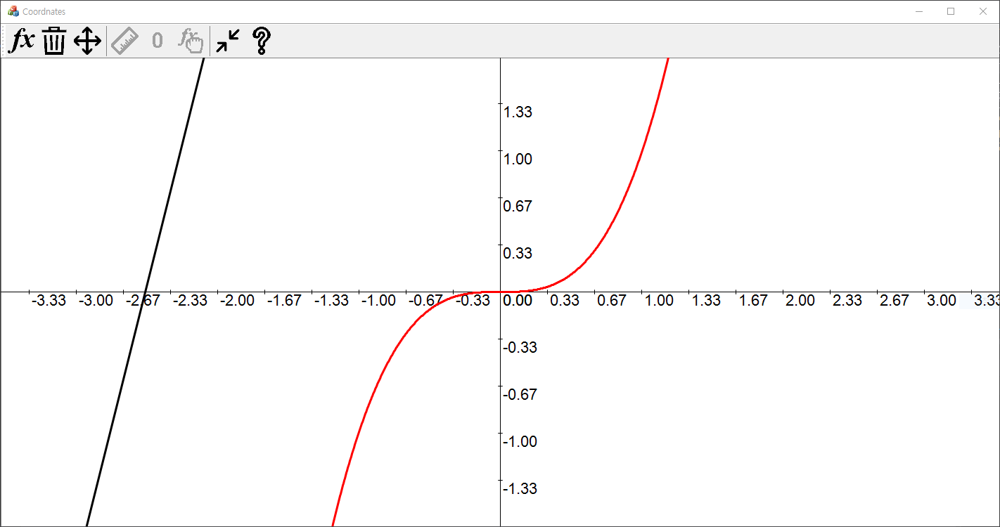
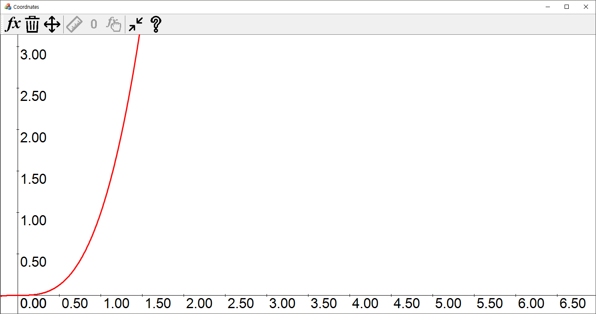

# - 평면 좌표 개인프로젝트

- ~ 2019 . 07 . 11

- **To do list**

- [x] 눈금 그리기

- [x] 눈금에 맞는 숫자 그리기

- [x] 화면 움직이기

- [x] 컨트롤 + 스크롤로 확대/축소

- [x] 함수 선택하여 지우기

- [x]  툴바 수정하기

- **함수 선택하여 지우기**

    ```c++
    void CManager::Select(UINT nFlag, CPoint& pt)
    {
    	for (auto i = m_Funs.begin(); i != m_Funs.end(); i++)
    	{
    		if ((*i)->IsSelected(pt, m_Rect.CenterPoint()))
    		{
    			if (nFlag != MK_CONTROL + MK_LBUTTON)
    				m_Selee.clear();
    			m_Selee.push_back(i);
    			break;
    		}
    	}
    }
    ```

사용자가 마우스 왼쪽 버튼을 클릭할 때 마다 호출되는 함수이다. CGraph::IsSelected() 함수를 사용해 검사한다.

```C++
bool CGraph::IsSelected(CPoint& pt, CPoint& center)
{
	return abs((center.y - f(pt.x - center.x)) - pt.y) < 40;
}
```

IsSelected() 의 리턴값이 true 이면 list<CGraph*>::iterator를 요소로 가지는 m_Selee 리스트에 집어넣는다. 이터레이터를 요소로 가지는 이유는 list의 erase() 함수에 m_Selee의 요소를 넣으면 삭제가 편하기 때문이다.

```C++
void CManager::Delete()
{
	for (auto itr : m_Selee)
	{
		delete *itr;
		m_Funs.erase(itr);
	}
	m_Selee.clear();
}
```

- **눈금, 숫자 그리기**

    ```C++
    void CManager::DrawCoordinate(Graphics & G, CRect & rect)
    {
    	. . . .
    
    int ratio = CGraph::m_nRatio;
    ratio /= (ratio / 100) + 1;
    
    CString str;
    PointF strPt;
    SolidBrush brush(Color(0,0,0));
    Gdiplus::Font F(_T("Arial"), ratio / 3, FontStyleRegular, UnitPixel);
    for (int i = pt.x % ratio; i < rect.right; i += ratio)
    {
    	G.DrawLine(&pen, i, pt.y - 3, i, pt.y + 3);
    	str.Format(_T("%.2lf"), (double)((i - pt.x) / ratio) / (CGraph::m_nRatio / 100 + 1));
    	strPt.X = REAL(i), strPt.Y = REAL(pt.y);
    	G.DrawString(str, str.GetLength(), &F, strPt, &brush);
    }
    for (int i = pt.y % ratio; i < rect.bottom; i += ratio)
    {
    	G.DrawLine(&pen, pt.x - 3, i, pt.x + 3, i);
    	str.Format(_T("%.2lf"), (double)-((i - pt.y) / ratio) / (CGraph::m_nRatio / 100 + 1));
    	strPt.X = REAL(pt.x), strPt.Y = REAL(i);
    	G.DrawString(str, str.GetLength(), &F, strPt, &brush);
    }
    }
    ```

- **툴바 수정하기**

    

[iconfinder.com](http://iconfinder.com/) 에서 아이콘을 받아와

[pixlr.com](https://pixlr.com/x/) 에서 편집.

각각 함수 추가, 삭제, 이동, 눈금 표시, 숫자 표시, 선택 목록, 확대/축소/이동 초기화, 프로그램 정보 이다.

- **오브젝트 이동**

CGraph에 정적 멤버 변수 m_nDx, m_nDy 를 사용하여 도형을 그릴 때 이 값 만큼 움직여 출력하도록 한다. 

CCoordView::OnLButtonDown() 함수 에서 초기 좌표를 기록, 마우스를 클릭하며 움직일 때 마다 변화량을 구하고 초기 좌표를 현재 좌표로 갱신한다. 변화량 만큼 m_nDx, m_nDy를 수정한다.

```C++
void CCoordView::OnLButtonDown(UINT nFlags, CPoint point)
{
	m_Manager.Select(nFlags, point);
	m_StartPt = point; // 초기 좌표	CView::OnLButtonDown(nFlags, point);
}

void CCoordView::OnMouseMove(UINT nFlags, CPoint point)
{
	if (nFlags & MK_LBUTTON)
	{
		CPoint delta = m_StartPt - point;
		m_Manager.OnScreenMove(delta.x, delta.y); // 변화량을 파라미터로 넘김
		m_StartPt = point; // 초기좌표 갱신
		Invalidate(TRUE);
	}
	CView::OnMouseMove(nFlags, point);
}

void CManager::OnScreenMove(int dx, int dy)
{
	CGraph::m_nDx -= dx;
	CGraph::m_nDy -= dy;
}
```

- **스크롤로 확대, 축소**

저번 파트에서 만들었던 정적 변수 m_nRatio의 값만 바꾸면 될 일이다.

```C++
BOOL CCoordView::OnMouseWheel(UINT nFlags, short zDelta, CPoint pt)
{
	// TODO: 여기에 메시지 처리기 코드를 추가 및/또는 기본값을 호출합니다.
	if (nFlags == MK_CONTROL)
	{
		m_Manager.OnZoom(zDelta);
		Invalidate(TRUE);
	}
	return CView::OnMouseWheel(nFlags, zDelta, pt);
}

void CManager::OnZoom(short zDelta)
{
	int ratio = CGraph::m_nRatio + (zDelta / 60);
	if (ratio < 30)
		return;
	CGraph::m_nRatio = ratio;
}
```

- **실행 화면**



확대 및 눈금, 숫자



이동