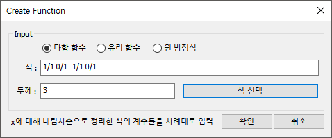
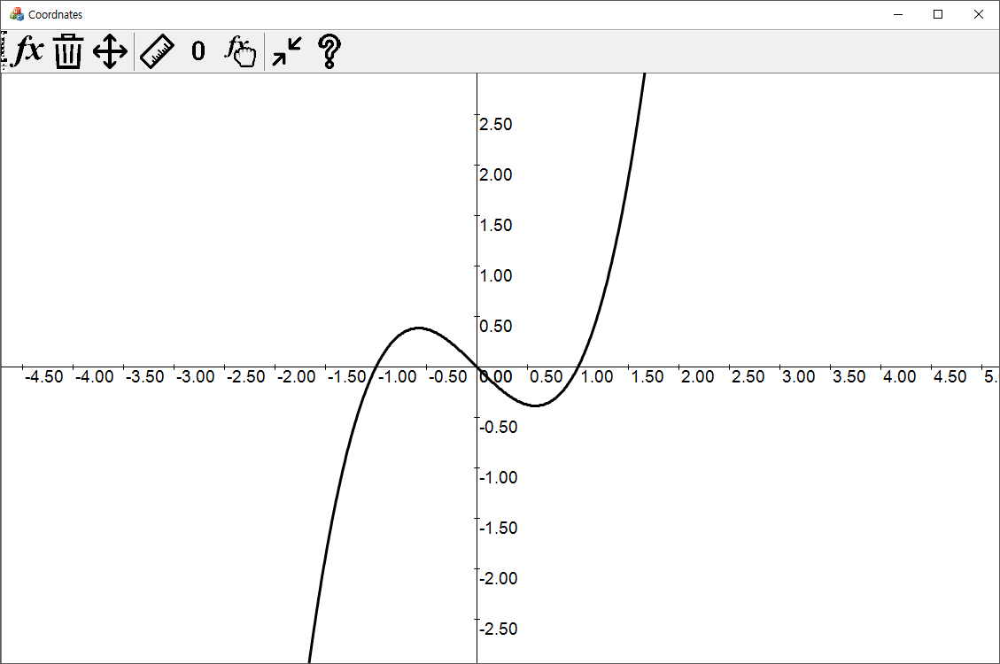
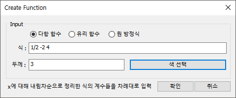
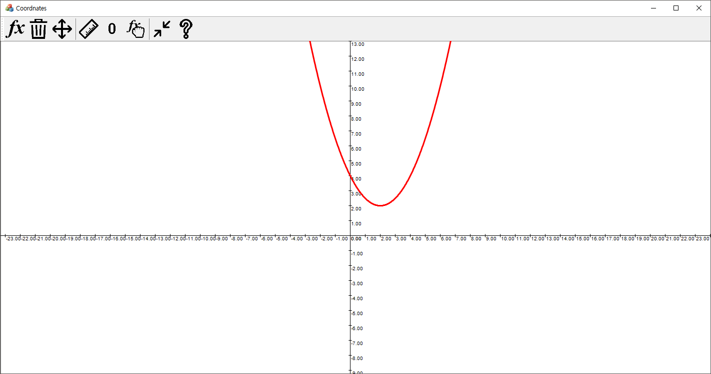
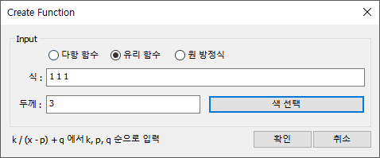
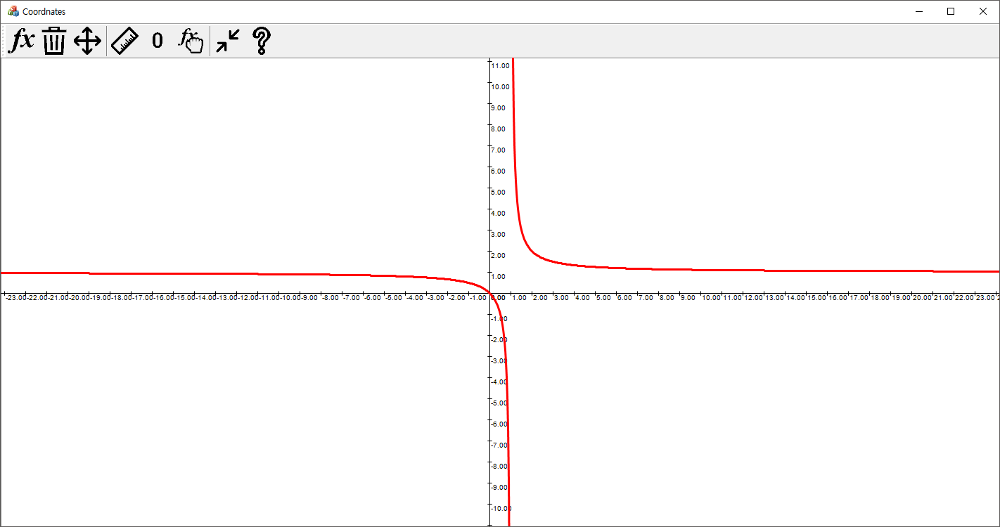
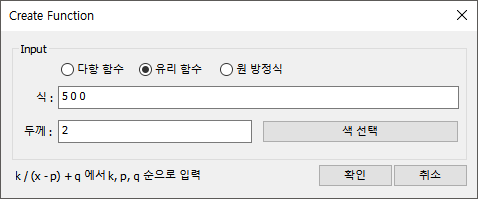
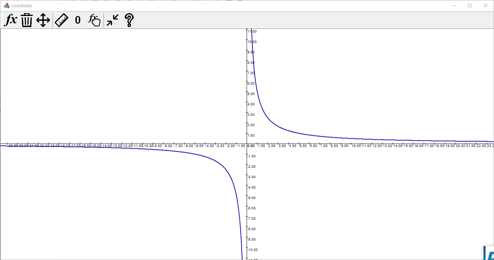

# - 평면 좌표 개인 프로젝트

- ~ 2019 . 07 . 15

- **To do list**
- [x]  함수 추가 대화상자 만들기
- [x]  함수 파일 불러오기
- [x]  함수 파일 저장하기
- [x]  유리함수 구현

- **함수 추가 대화상자**





$$
y = x^3 - x
$$






$$
y = \frac{1}{2}x^2 - 2x + 4
$$

- **유리함수 구현**

단순히 CCurve 클래스에서 상속받아 int f(int x) 함수만 재정의함.

```C++
int CRational::f(int x)
{
	return (int)round((m_Coeff[0] / (double(x) / m_nRatio
 - m_Coeff[1]) + m_Coeff[2]) * m_nRatio);
}
```





$$
y = \frac{1}{x - 1} + 1
$$






$$
y = \frac{5}{x}
$$

- **계획 수정**


함수 평행 이동, 선택된 함수 대화상자를 접고 저장, 불러오기 기능 추가

- **함수 파일 저장하기 및 불러오기**

    ```c++
    void CGraph::Selialize(CArchive & ar, Child kind)
    {
    	if (kind == null)
    		return;
    	if (ar.IsStoring())
    	{
    		ar << kind;
    		ar << m_Coeff.size();
    		for (const auto i : m_Coeff)
    		{
    			ar << i.GetSon();
    			ar << i.GetMom();
    		}
    		ar << m_Color.GetValue();
    		ar << m_nThick;
    	}
    	else
    	{
    		ARGB color;
    		int size, s, m, thick;
    		ar >> size;
    		for (int i = 0; i < size; i++)
    		{
    			ar >> s >> m;
    			m_Coeff.push_back(CFract(s, m));
    		}
    		ar >> color;
    		ar >> thick;
    		m_Color.SetValue(color);
    		m_nThick = thick;
    	}
    }
    ```
    
    