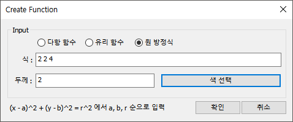
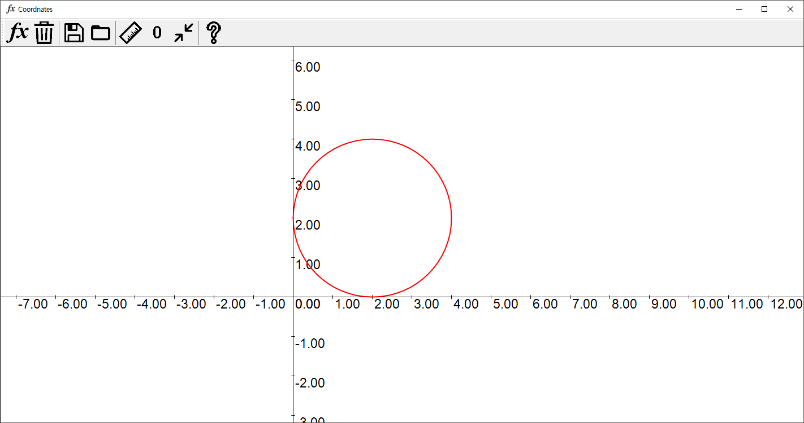
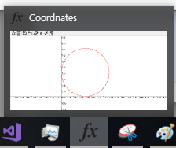
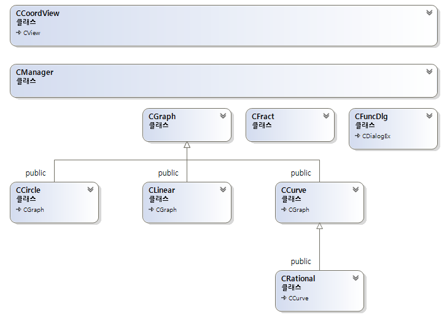

# - 평면 좌표 개인 프로젝트

- ~ 2019 . 07 . 19

---

- To do List
- [x]  원 방정식
- [x]  아이콘 수정
- [x]  완성!

- **원 방정식**





$$(x - 2)^2 + (y - 2)^2 = 4$$

```C++
bool CCircle::IsSelected(CPoint & pt, CPoint & center)
{
	double dis, radius = sqrt(m_Coeff[2]) * m_nRatio;
	int dx = (int)round(m_Coeff[0] * m_nRatio), dy = (int)round(m_Coeff[1] * m_nRatio);
	center.Offset(m_nDx + dx, m_nDy - dy);
	dis = sqrt(pow(center.x - pt.x, 2) + pow(center.y - pt.y, 2));
	return abs(dis - radius) < 10;
}
```

원이 선택되었는지는 클릭한 점과 원의 중심 거리를 구해 반지름과의 차로 판단함.

- **아이콘 수정**



- **완성!**


약 2주간의 개발이 끝났다. 조금 생소한 GDI+ 라이브러리를 사용했고, 생각이 많이 필요한 프로젝트였다. 처음 구상한 기능들이 개발하며 한계를 느끼고 포기했던 부분이 많이 아쉽다. 개발 실력의 한계가 아닌 지금 알고있는 수학적 지식이 많이 부족함을 느꼇다.

고등학교 올라와서 처음으로 멋들어진 프로젝트를 완성하였다. 아직 찾지 못한 버그가 있을수도 있겠지만 완성했다는것에 뿌듯함을 느낀다.

만드는 과정들은 전부 Github에 업데이트 하였고 완성본 코드도 모두 볼 수 있다. 

[https://github.com/BayernMuller/Coordinate](https://github.com/BayernMuller/Coordinate)

